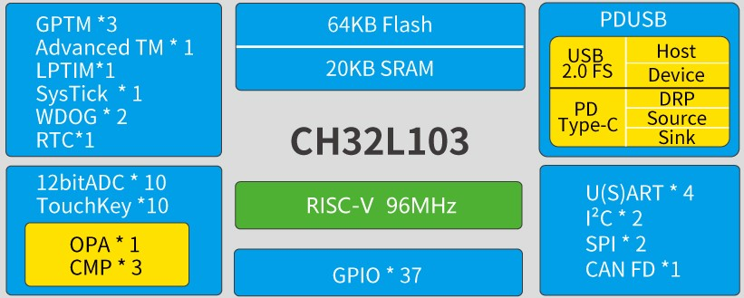
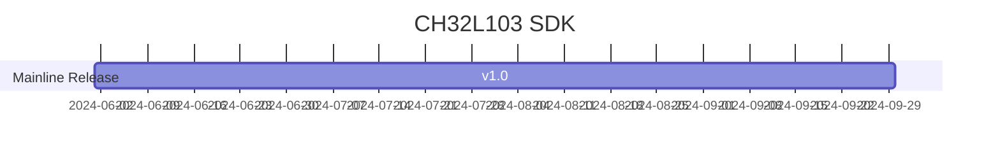

# [CH32L103](https://github.com/SoCXin/CH32L103)

* [WCH](http://www.wch.cn/)：[RISC-V](https://github.com/SoCXin/RISC-V)
* [L1R1](https://github.com/SoCXin/Level): 96 MHz 

## [简介](https://github.com/SoCXin/CH32L103/wiki)

[CH32L103](https://www.wch.cn/products/CH32L103.html)系列是基于青稞RISC-V内核设计的工业级低功耗通用微控制器。CH32L103内置USB和PD PHY，支持PDUSB，包括USB Host主机和USB Device设备功能、USB PD及Type-C快充功能，内置低功耗定时器，提供了1 组 OPA 运放、多组CMP电压比较器、4组USART串口、2个I2C接口、2个SPI接口、1组CAN 接口、多组定时器、12位ADC、10路Touchkey 等丰富外设资源。 

### 关键特性

* 96MHz RISC-V4C
* 20KB SRAM + 64KB Flash
* 8路通用DMA控制器
* 1组运放OPA/PGA/电压比较器
* 3组模拟电压比较器CMP
* 10路外部12位ADC转换通道
* 10路TouchKey通道检测
* 1个16位低功耗定时器
* 1个16位高级定时器
* 2个16位通用定时器
* 1个32位通用定时器
* 2个看门狗定时器（独立和窗口）
* 1个系统时基定时器
* 4x USART：支持LIN和ISO7816，≤ 6Mbps
* 2个I2C接口：支持SMBus/PMBus
* 2个SPI接口
* 1组CANFD接口（2.0B主动）
* USB2.0全速控制器及PHY
* USB PD和Type C控制器及PHY
* 快速GPIO端口，支持16个外部中断
* 封装：LQFP48、QFN32、QSOP28、QFN20、TSSOP20

## [资源收录](https://github.com/SoCXin)

* [参考资源](src/)
* [参考文档](docs/)
* [参考工程](project/)
* [mounriver开发环境](http://www.mounriver.com/download)

## [选型建议](https://github.com/SoCXin)

[CH32L103](https://github.com/SoCXin/CH32L103) 

相对[CH32X035](https://www.wch.cn/products/CH32X035.html)主频从48MHz提高到96MHz